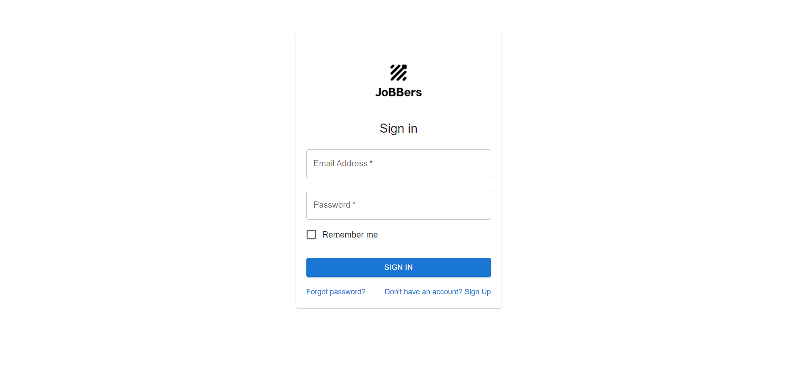
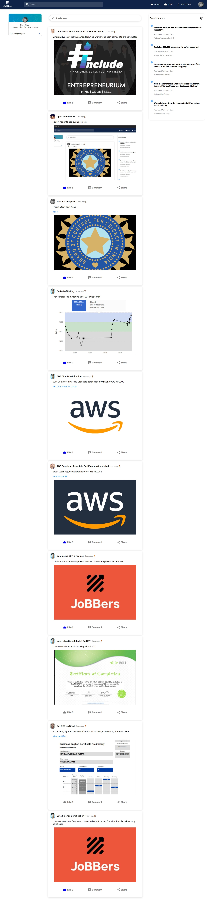
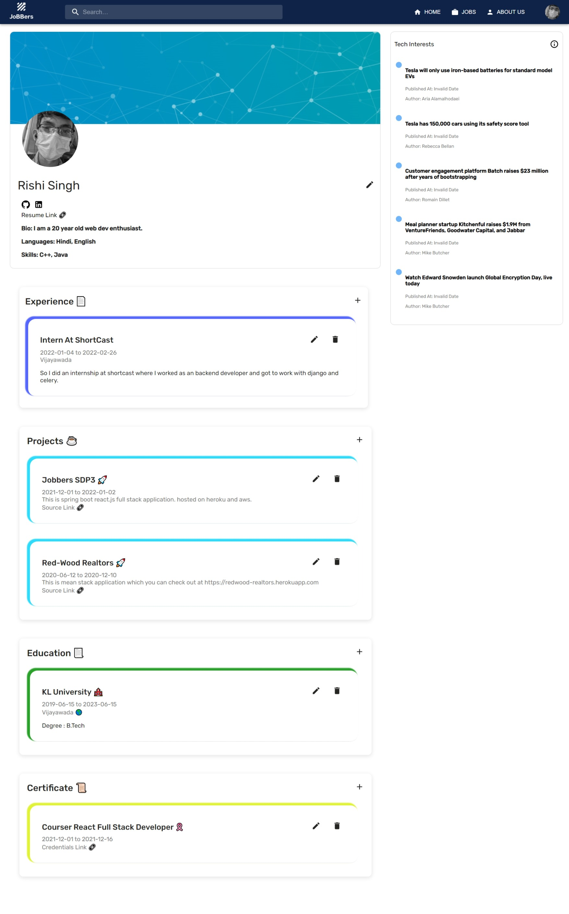

# Jobbers
This is a website for finding jobs and creating a professional portfolio. And also for keeping up with the community in which you are most
interested in.

##### Creators -> Navneet Kumar Singh, Aditya Khandelwal, Udbhav Govindu

### Tech Stack used:- 
React.js, Spring Boot with PostgreSql.

# Project URL :-
https://jobbers.netlify.app/

# Login Page :-

  

# Home Page :-

  

# Profile Page :-

  

